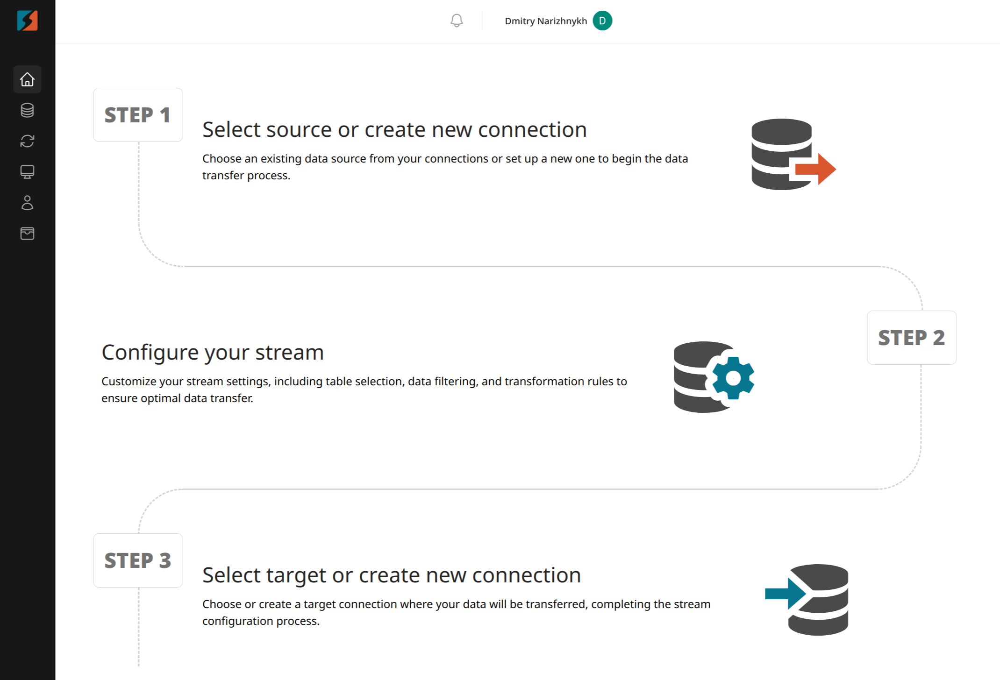
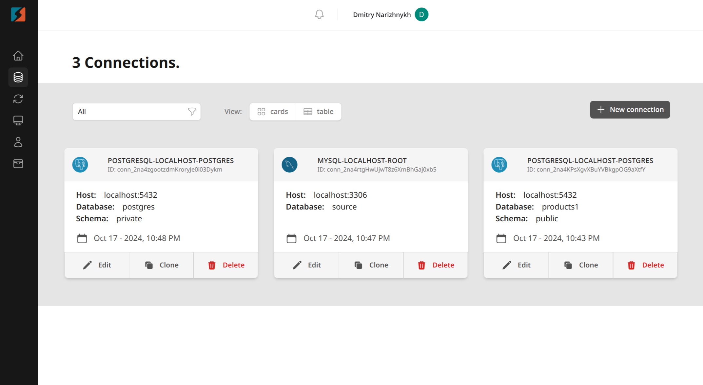
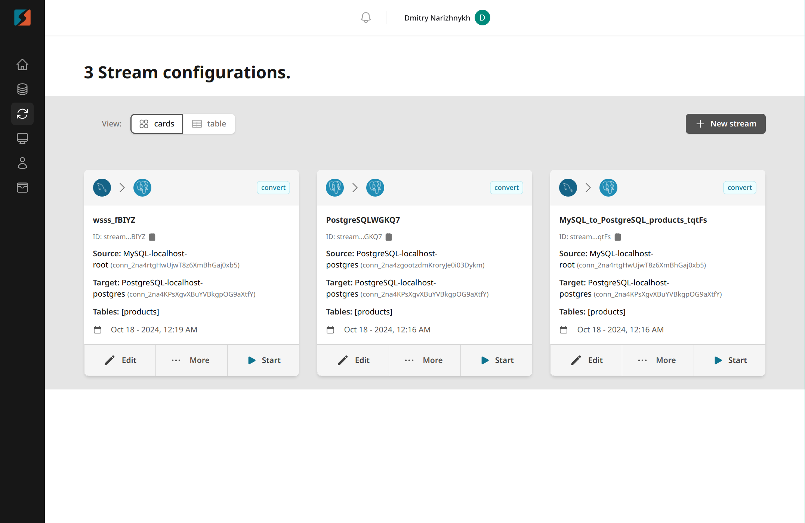
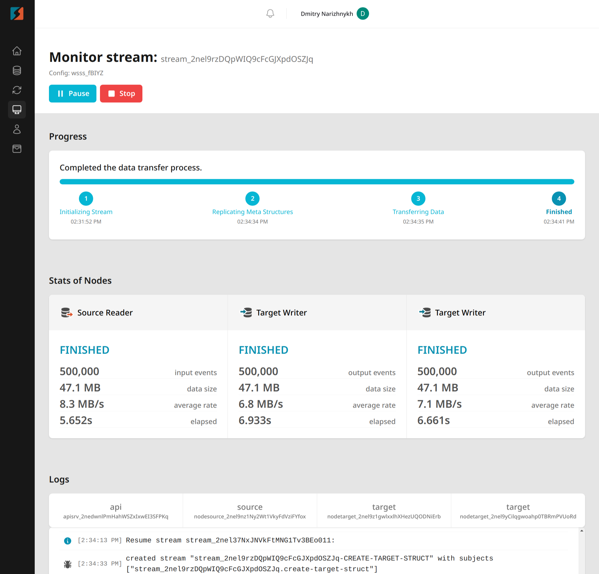

# DBConvert Streams UI

## Overview

DBConvert Streams is a powerful application for efficient data migration and real-time Change Data Capture (CDC) replication. For more information, visit [stream.dbconvert.com](https://stream.dbconvert.com). This repository contains the frontend user interface, built with Vue 3, Vite, and TypeScript, designed to simplify managing your data flows between multiple databases.

## Key Features

- **Create and Manage Connections**: Set up and handle various database connections easily.
- **Configure Streams**: Full control over creating and configuring data streams.
- **Monitor Streams**: Track, manage, and visualize the progress of ongoing data streams in real time.
- **User Dashboard**: Easily manage API keys, check your usage statistics, and monitor your data transfer consumption.
- **Responsive Design**: Built with Tailwind CSS to provide an intuitive and accessible experience across devices.

## Prerequisites

- **Node.js**: Version 14 or higher.
- **npm**: Version 6 or higher.

## Installation and Setup

To get started with DBConvert Streams UI, follow these steps:

1. **Clone the Repository**

2. **Install Dependencies**

3. **Set Up Environment Variables**
   Create a `.env` file in the root directory and add the following variables. Replace `your_key` with your actual credentials:

4. **Start the Development Server**

5. **View the Application**
   Open your browser and navigate to `http://localhost:5173` to view and interact with the UI.

> **Note**: A common script will soon be available to install DBConvert Streams backend services and dependencies automatically, simplifying the setup process.

## Screenshots

Here are some screenshots to help you get familiar with the UI:

- **Dashboard Overview**
  

- **Connection Management**
  

- **Streams Configuration**
  

- **Stream Settings**
  

- **Real-Time Monitoring**
  

## Contributing

We welcome contributions! If you would like to contribute, please fork the repository and submit a pull request. Make sure to follow the contribution guidelines and coding standards mentioned in the repository.

## License

This project is licensed under the MIT License - see the [LICENSE](./LICENSE) file for details.

## Need Help?

If you run into issues or have questions, feel free to open an issue in the GitHub repository or contact the support team at [streams@dbconvert.com](mailto:streams@dbconvert.com).
